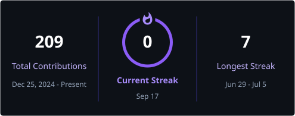
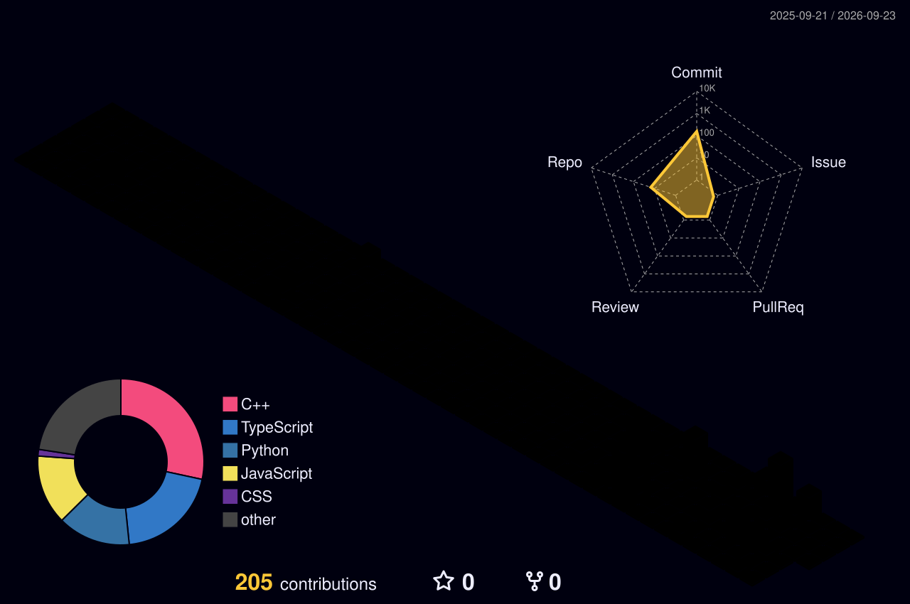

 

  

  

  

---

<h2 align="center">✦ ABOUT ME</h2>

### Software Engineering • Full Stack • DSA • AI

I'm a **3rd-year Information Technology student** focused on becoming a strong software engineer through building, problem solving and continuous experimentation.

My primary focus is **full-stack web development and Data Structures & Algorithms**, with an additional interest in **AI/ML, computer vision and intelligent systems**.

I like working across the complete engineering cycle:

`Problem → Architecture → Code → Test → Deploy → Iterate`

Currently, I'm strengthening my foundations in **C++, DSA, backend engineering and system design** while building practical products with modern web technologies.

 

`FULL-STACK DEVELOPMENT` &nbsp; • &nbsp;
`C++ / DSA` &nbsp; • &nbsp;
`AI / ML` &nbsp; • &nbsp;
`SYSTEMS`

  

**Open to:** Software Engineering Internships · Full-Stack Roles · AI Engineering · Research · Open Source

---

<h2 align="center">⚡ WHAT I WORK WITH</h2>

### Languages

  

### Frontend

  

### Backend & Data

  

### Engineering Tools

---

<h2 align="center">🧠 ENGINEERING INTERESTS</h2>

| Focus | What I'm Building Toward |
|:---:|:---|
| **Full Stack** | React applications, REST APIs, authentication, databases and production-ready web systems |
| **DSA** | C++, algorithms, complexity analysis and interview-level problem solving |
| **Backend** | Node.js, Express, APIs, databases and scalable application architecture |
| **AI / ML** | Applied machine learning, computer vision and intelligent applications |
| **Systems** | Computer networks, NS-3 experimentation and intelligent routing |
| **Research** | Optimization, computational intelligence and experimental ML |

---

<h2 align="center">🚀 SELECTED WORK</h2>

<b>PHOENIX — Intelligent MANET Routing</b>

 

A research-oriented **NS-3 framework for intelligent routing in Mobile Ad Hoc Networks**, focused on adaptive routing, network intelligence and optimization.

| | |
|---|---|
| **Stack** | C++, NS-3, Python, Reinforcement Learning, ACO |
| **Domain** | Computer Networks / Intelligent Routing |
| **Evaluation** | PDR, throughput, delay, routing overhead |
| **Engineering** | Modular simulation architecture + reproducible experiments |
| **Repository** | [PHOENIX-MANET](https://github.com/HITESHVERMA01/PHOENIX-MANET) |

**Key work:** baseline routing, network-health analysis, mobility prediction, adaptive optimization, congestion-aware routing and multi-seed experimentation.

 

`C++` `NS-3` `Python` `Networking` `Reinforcement Learning`

 

<b>IR2RGB — Satellite Image Enhancement</b>

 

An AI/computer-vision project for satellite image reconstruction and enhancement using super-resolution and image-processing techniques.

| | |
|---|---|
| **Stack** | Python, EDSR, OpenCV |
| **Domain** | Satellite Remote Sensing |
| **Techniques** | ×2 Super Resolution, CLAHE, Adaptive Sharpening |
| **Evaluation** | PSNR, SSIM, MAE |
| **Repository** | [IR2RGB](https://github.com/CodeXEaters/IR2RGB) |

 

`Python` `Computer Vision` `EDSR` `OpenCV` `Satellite AI`

 

<b>UPI Fraud Detection</b>

 

An applied machine-learning project focused on detecting potentially fraudulent UPI transactions through a prediction-oriented workflow and web interface.

| | |
|---|---|
| **Stack** | Python, Machine Learning, React, JavaScript |
| **Domain** | AI / FinTech |
| **Focus** | Fraud classification and prediction |
| **Engineering** | ML workflow + frontend integration |
| **Repository** | [GitHub](https://github.com/HITESHVERMA01) |

 

`Python` `Machine Learning` `React` `FinTech`

 

<b>AI Surveillance System</b>

 

A computer-vision prototype using YOLO-based object detection for intelligent visual monitoring.

| | |
|---|---|
| **Stack** | Python, YOLO, Computer Vision |
| **Domain** | Applied AI |
| **Focus** | Object detection and visual monitoring |
| **Engineering** | Detection pipeline and real-time vision concepts |
| **Repository** | [GitHub](https://github.com/HITESHVERMA01) |

 

`Python` `YOLO` `Computer Vision` `AI`

 

<b>CVNN-Based Vermicomposting Research</b>

 

Research-oriented experimentation applying computational intelligence to flower-waste vermicomposting.

| | |
|---|---|
| **Stack** | Python, RVNN, CVNN, QVNN |
| **Techniques** | FFT, Hilbert Transform, Wavelet Transform |
| **Evaluation** | MAE-based model comparison |
| **Domain** | AI + Sustainable Computing |
| **Repository** | [GitHub](https://github.com/HITESHVERMA01) |

 

`Python` `CVNN` `QVNN` `Machine Learning` `Research`

---

<h2 align="center">💼 EXPERIENCE</h2>

### Frontend AI Engineering Intern · Flyrank AI

`2026 — Present`

Working in a startup environment combining **frontend engineering, AI-assisted development and product execution**.

- Building and iterating modern frontend interfaces.
- Working with React and JavaScript development workflows.
- Integrating AI capabilities into practical product experiences.
- Translating product requirements into working interfaces.
- Using AI-assisted engineering workflows to accelerate development.

`React` `JavaScript` `Frontend` `AI Engineering` `Git` `GitHub`

 

### Growth Intern · Kupid Dating

`Startup Experience`

Worked in an early-stage startup environment focused on **growth, experimentation, user acquisition and product execution**.

- Supported growth initiatives.
- Worked around acquisition and engagement.
- Contributed to experimentation and product activities.
- Developed practical exposure to startup metrics and execution.

`Growth` `Product` `Analytics` `Experimentation`

---

<h2 align="center">⌁ PROBLEM SOLVING</h2>

  

---

<h2 align="center">📊 GITHUB PULSE</h2>

  

---

<h2 align="center">🌈 CONTRIBUTION MATRIX</h2>

---

<h2 align="center">🐍 CONTRIBUTION SNAKE</h2>

<picture>
  <source media="(prefers-color-scheme: dark)" srcset="https://raw.githubusercontent.com/HITESHVERMA01/HITESHVERMA01/output/github-contribution-grid-snake-dark.svg">
  <source media="(prefers-color-scheme: light)" srcset="https://raw.githubusercontent.com/HITESHVERMA01/HITESHVERMA01/output/github-contribution-grid-snake.svg">
  
</picture>

---

<h2 align="center">📈 ACTIVITY</h2>

---

## ✦ What I'm Working On

<table>
<tr>
<td width="25%" align="center">

### ⚡ BUILDING

Full-stack web applications

React • Node.js • Express  
REST APIs • MongoDB

</td>

<td width="25%" align="center">

### 🧠 SOLVING

Data Structures & Algorithms

C++ • Problem Solving  
Complexity • Competitive Programming

</td>

<td width="25%" align="center">

### 🤖 EXPLORING

AI / ML & Intelligent Systems

Python • Computer Vision  
Machine Learning • Research

</td>

<td width="25%" align="center">

### 🚀 GROWING

Software Engineering

System Design • Git  
Architecture • Open Source

</td>
</tr>
</table>

 

---

## ✦ Open To

`Software Engineering Internships` &nbsp;•&nbsp;
`Full-Stack Development` &nbsp;•&nbsp;
`AI Engineering` &nbsp;•&nbsp;
`Research Collaboration` &nbsp;•&nbsp;
`Hackathons` &nbsp;•&nbsp;
`Open Source`

  

  

### ✦ *“Stay curious. Build relentlessly.”*

— Hitesh Verma

  

