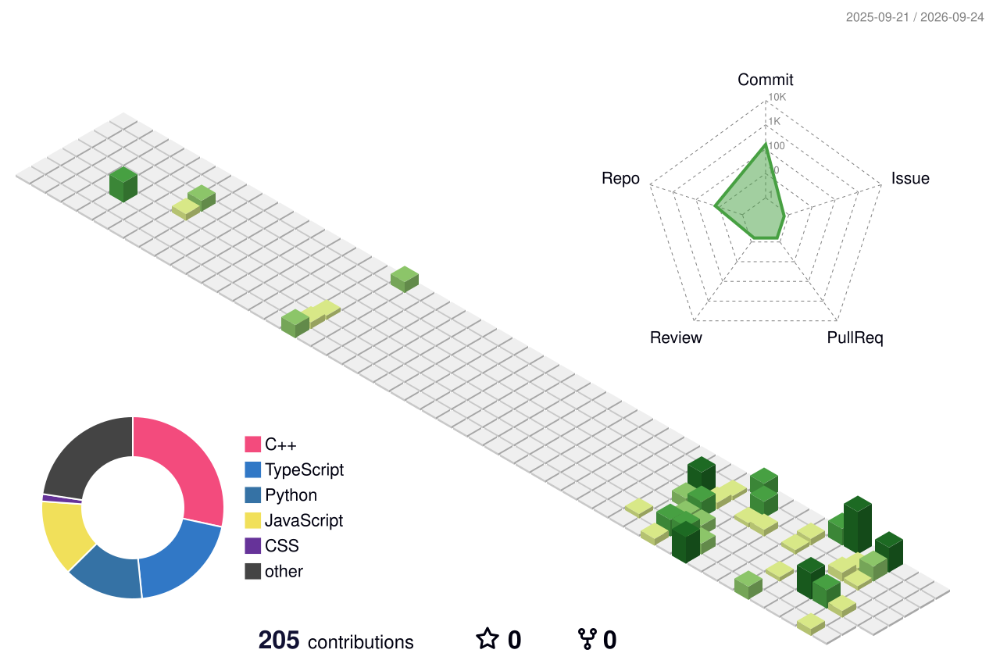

<div align="center">


<br/>

<a href="https://readme-typing-svg.demolab.com/">

</a>

<br/><br/>


<br/><br/>

<a href="https://github.com/HITESHVERMA01">

</a>
<a href="mailto:your-email@example.com">

</a>
<a href="https://www.linkedin.com/in/YOUR-LINKEDIN-USERNAME/">

</a>

<br/><br/>


</div>

---

## `01 // SYSTEM PROFILE`

<table>
<tr>
<td width="58%">

```yaml
name: Hitesh Verma
role: 3rd Year IT Student
primary_focus:
  - Full-Stack Web Development
  - Data Structures & Algorithms
  - C++ Problem Solving
secondary_focus:
  - AI/ML Engineering
  - Computer Vision
  - Research & Intelligent Systems

mindset:
  - Build
  - Measure
  - Learn
  - Iterate

currently:
  building: Full-Stack + AI applications
  learning: Advanced DSA & System Design
  exploring: AI/ML & intelligent systems
```

</td>
<td width="42%" align="center">

```text
┌─────────────────────────────┐
│       HITESH.EXE            │
│                             │
│  Full Stack     ████████    │
│  DSA / C++      ████████    │
│  AI / ML        ██████      │
│  Systems        ██████      │
│                             │
│  status: BUILDING           │
└─────────────────────────────┘
```

</td>
</tr>
</table>

---

## `02 // WHAT I BUILD`

I am a **3rd-year Information Technology student** focused on becoming a strong software engineer through hands-on development, problem solving, and continuous experimentation.

My primary engineering focus is **full-stack web development and data structures & algorithms**, while I also work on **AI/ML and research-oriented systems**.

I enjoy taking an idea from **problem → architecture → implementation → testing → deployment**.

### Current Direction

* Building full-stack applications with modern JavaScript/React ecosystems.
* Strengthening **C++ and DSA** for software engineering interviews.
* Developing practical AI/ML projects rather than only studying theory.
* Exploring system design, backend architecture, and scalable applications.
* Building projects that demonstrate engineering depth, not just UI.

### Open To

`Software Engineering Internships` · `Full-Stack Development` · `AI Engineering` · `Research Collaboration` · `Open Source`

---

## `03 // TECH STACK`

<div align="center">

### Languages


### Frontend


### Backend & Databases


### Tools & Development


</div>

---

## `04 // ENGINEERING FOCUS`

| Area                       | Focus                                                                |
| -------------------------- | -------------------------------------------------------------------- |
| **Full-Stack Development** | React, JavaScript, Node.js, Express, APIs, MongoDB, Firebase         |
| **DSA & C++**              | Data structures, algorithms, problem solving, complexity analysis    |
| **Frontend Engineering**   | Responsive interfaces, component architecture, modern UI development |
| **Backend Engineering**    | REST APIs, database integration, application architecture            |
| **AI / ML**                | Applied ML, computer vision, intelligent systems                     |
| **Computer Networks**      | NS-3, MANETs, routing and network experimentation                    |
| **Research**               | Experimental ML, optimization and computational intelligence         |

---

## `05 // FEATURED BUILDS`

<details>
<summary><b>PHOENIX — Intelligent MANET Routing Framework</b></summary>

<br/>

A research-oriented **NS-3 framework for intelligent routing in Mobile Ad Hoc Networks**, combining network intelligence, adaptive optimization and routing experimentation.

| Metric          | Details                                                         |
| --------------- | --------------------------------------------------------------- |
| **Stack**       | C++, NS-3, Python, Reinforcement Learning, ACO                  |
| **Focus**       | Intelligent routing and network optimization                    |
| **Evaluation**  | PDR, throughput, delay, routing overhead                        |
| **Engineering** | Modular simulation architecture and reproducible experiments    |
| **Repository**  | [PHOENIX-MANET](https://github.com/HITESHVERMA01/PHOENIX-MANET) |

**Work includes:** baseline routing, network-health analysis, mobility prediction, adaptive optimization, congestion-aware decisions, multi-seed experiments and automated result generation.

</details>

<br/>

<details>
<summary><b>IR2RGB — Satellite Image Enhancement</b></summary>

<br/>

An AI/computer-vision project for satellite image reconstruction and enhancement using super-resolution and image-processing techniques.

| Metric         | Details                                               |
| -------------- | ----------------------------------------------------- |
| **Stack**      | Python, EDSR, OpenCV, CLAHE                           |
| **Focus**      | Satellite remote sensing                              |
| **Techniques** | ×2 super-resolution, contrast enhancement, sharpening |
| **Evaluation** | PSNR, SSIM, MAE                                       |
| **Repository** | [IR2RGB](https://github.com/CodeXEaters/IR2RGB)       |

</details>

<br/>

<details>
<summary><b>UPI Fraud Detection</b></summary>

<br/>

An applied machine-learning project focused on identifying potentially fraudulent UPI transactions through a prediction-oriented workflow.

| Metric          | Details                                                       |
| --------------- | ------------------------------------------------------------- |
| **Stack**       | Python, Machine Learning, React, JavaScript                   |
| **Focus**       | Financial fraud detection                                     |
| **Engineering** | Data processing, prediction workflow and frontend integration |
| **Domain**      | AI + FinTech                                                  |
| **Repository**  | [GitHub](https://github.com/HITESHVERMA01)                    |

</details>

<br/>

<details>
<summary><b>AI Surveillance System</b></summary>

<br/>

A computer-vision prototype using YOLO-based object detection for intelligent visual monitoring.

| Metric          | Details                                          |
| --------------- | ------------------------------------------------ |
| **Stack**       | Python, YOLO, Computer Vision                    |
| **Focus**       | Object detection                                 |
| **Engineering** | Detection pipeline and real-time vision concepts |
| **Domain**      | Applied AI                                       |
| **Repository**  | [GitHub](https://github.com/HITESHVERMA01)       |

</details>

<br/>

<details>
<summary><b>CVNN-Based Vermicomposting Research</b></summary>

<br/>

Research-oriented experimentation applying computational intelligence to flower-waste vermicomposting.

| Metric         | Details                                    |
| -------------- | ------------------------------------------ |
| **Stack**      | Python, CVNN, RVNN, QVNN                   |
| **Techniques** | FFT, Hilbert Transform, Wavelet Transform  |
| **Evaluation** | MAE-based model comparison                 |
| **Domain**     | AI + Sustainable Computing                 |
| **Repository** | [GitHub](https://github.com/HITESHVERMA01) |

</details>

---

## `06 // EXPERIENCE`

### Frontend AI Engineering Intern — Flyrank AI

**2026 · Present**

Working in a startup environment at the intersection of **frontend engineering and AI-assisted product development**.

* Building and iterating frontend interfaces.
* Working with modern JavaScript/React development workflows.
* Integrating AI capabilities into practical product experiences.
* Translating product requirements into working interfaces.
* Using AI-assisted engineering workflows to accelerate development.

`React` `JavaScript` `Frontend Engineering` `AI Engineering` `Git` `GitHub`

---

### Growth Intern — Kupid Dating

Worked in an early-stage startup environment focused on **growth, experimentation, user acquisition and product execution**.

* Supported growth initiatives.
* Worked around user acquisition and engagement.
* Contributed to startup experimentation.
* Developed practical exposure to product and user metrics.

`Growth` `Product` `Analytics` `User Acquisition` `Experimentation`

---

## `07 // CODING & PROBLEM SOLVING`

<div align="center">

<a href="https://leetcode.com/">

</a>

<a href="https://www.geeksforgeeks.org/">

</a>

<a href="https://www.hackerrank.com/">

</a>

<a href="https://www.codechef.com/">

</a>

</div>

---

## `08 // GITHUB ANALYTICS`

<div align="center">


<br/><br/>


</div>

---

## `09 // 3D CONTRIBUTION MATRIX`

<div align="center">



</div>

---

## `10 // CONTRIBUTION SNAKE`

<div align="center">

<picture>
  <source media="(prefers-color-scheme: dark)" srcset="https://raw.githubusercontent.com/HITESHVERMA01/HITESHVERMA01/output/github-contribution-grid-snake-dark.svg">
  <source media="(prefers-color-scheme: light)" srcset="https://raw.githubusercontent.com/HITESHVERMA01/HITESHVERMA01/output/github-contribution-grid-snake.svg">
  
</picture>

</div>

---

## `11 // ACTIVITY`

<div align="center">

<a href="https://github.com/HITESHVERMA01">

</a>

</div>

---

## `12 // CURRENT FOCUS`

```yaml
student:
  year: 3rd
  degree: B.Tech Information Technology

primary:
  - Full-Stack Web Development
  - Data Structures & Algorithms
  - C++ Problem Solving

secondary:
  - AI/ML Engineering
  - Computer Vision
  - Research
  - Computer Networks

learning:
  - Advanced DSA
  - System Design
  - Backend Architecture
  - Scalable Web Applications

building:
  - Full-Stack Applications
  - AI-powered Products
  - PHOENIX MANET Research Framework

exploring:
  - Reinforcement Learning
  - Intelligent Systems
  - Open Source
  - Production Engineering

open_to:
  - Software Engineering Internships
  - Full-Stack Opportunities
  - AI Engineering
  - Research Collaboration
  - Open Source
```

---

## `13 // CONNECT`

<div align="center">

<a href="mailto:your-email@example.com">

</a>

<a href="https://www.linkedin.com/in/YOUR-LINKEDIN-USERNAME/">

</a>

<a href="https://github.com/HITESHVERMA01">

</a>

</div>

---

<div align="center">

<b>Build. Solve. Ship. Repeat.</b>

<br/><br/>


</div>
